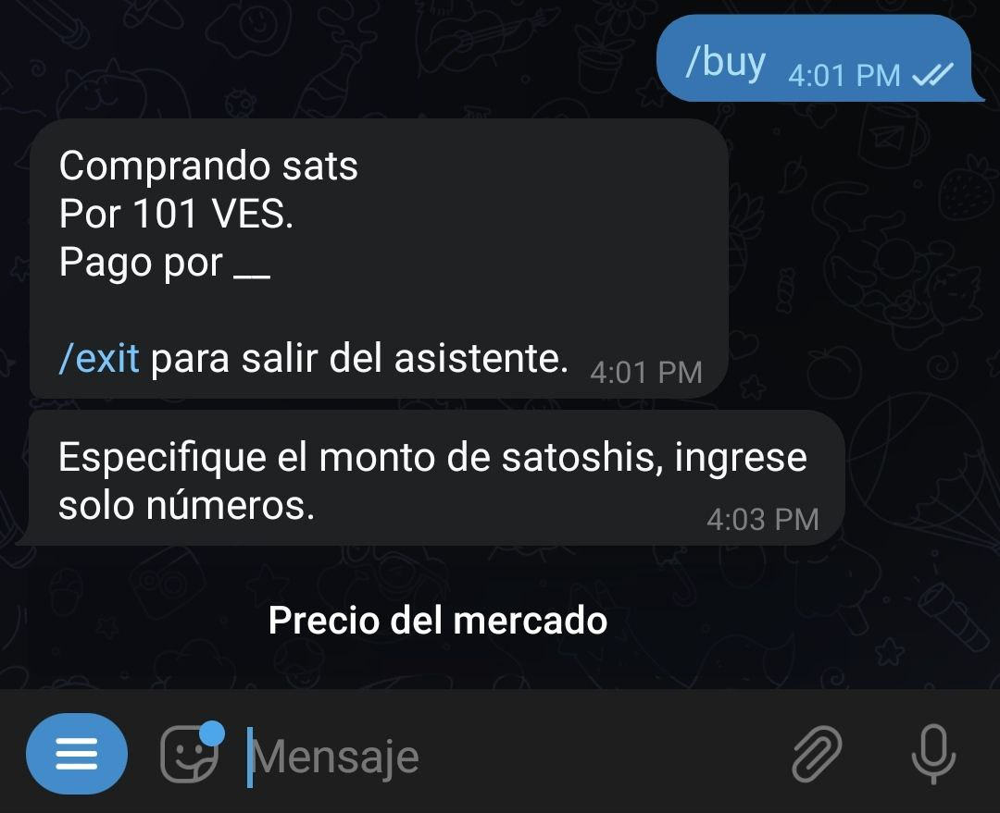

# How do I create a buy order?

The procedure is exactly the same as for a sell order. However, when you press the "Menu" button, select the `/buy` command instead of `/sell`. This will activate the wizard that guides you through the buying process.

Once activated, the wizard will prompt you to specify the fiat currency you want to transact with:

Next, enter the amount, in fiat currency, you wish to buy. Remember to input only numbers at this step so that the wizard can understand.

You can also enter a range of amounts to buy by separating the numbers with a hyphen (-).

The wizard will ask for the amount, in satoshis, you want to receive. Here, you have the option to use the "Market Price" button. If you do, it will apply the rate from [Yadio.io](https://yadio.io/).

Next, the wizard will request the percentage of premium or discount you desire in your exchange. If you want to increase the market rate (premium), select a positive number. If you want to decrease it (discount), choose a negative number. If you don’t want either, use the "No premium or discount" button.

You'll then need to specify the payment method. Here, you can get creative and add emojis or anything you feel will make your offer attractive.

The bot will proceed to publish your offer in the general channel or the one you've set as default for the community. It will remain visible for 23 hours if no one takes it before then.

At any time, you can cancel the offer, provided no one has taken it, using the command `/cancel` followed by the order identifier. You can also copy the command plus the identifier in the chat with the bot.

The wizard will return a message confirming the cancellation, and your offer will be removed from the offers channel.

If your offer is taken, the wizard will ask you to provide a Lightning Network invoice with the corresponding amount in satoshis. Simultaneously, it will ask your counterpart to pay the invoice.

At this point, the bot will connect both parties to discuss the exchange details.

Once you've made the fiat payment, notify the bot with the command `/fiatsent`. The bot will inform your counterpart to check and confirm the receipt of the money and proceed to release the satoshis. Remember, your wallet needs to be online to receive them.

The exchange is completed. Now you can rate your counterpart.

You can exit the wizard at any time by executing the command `/exit`.

To execute the same buy order without using the wizard, you must write your order details: `/buy` <satoshi amount> <fiat amount> <fiat code> <payment method> [premium/discount] (without special characters).

Example: `/buy 100000 50 usd "xyz bank"`

Buying one hundred thousand satoshis at fifty dollars paying via xyz bank.

Some examples of buy orders would be:

- Ex. `/buy 0 50 ves "xyz bank"`: Buying fifty bolivars in satoshis - in this case, the bot will calculate at the market rate - paying via xyz bank
- Ex. `/buy 0 10-100 pen "mobile payment"`: Buying from 10 to 100 new soles - in this case, the seller will choose the amount to sell you within that range - paying via mobile payment
- Ex. `/buy 0 100 eur "mobile payment" -3`: Buying 100 euros with a 3% discount - in this case, the bot will calculate at the market rate by discounting or increasing the percentage you choose - paying via mobile payment

If there's any incompatible variable, the bot will indicate it during the order creation process. Once completed, it will automatically publish on the exchange channel and remain visible for a period of 23 hours.
