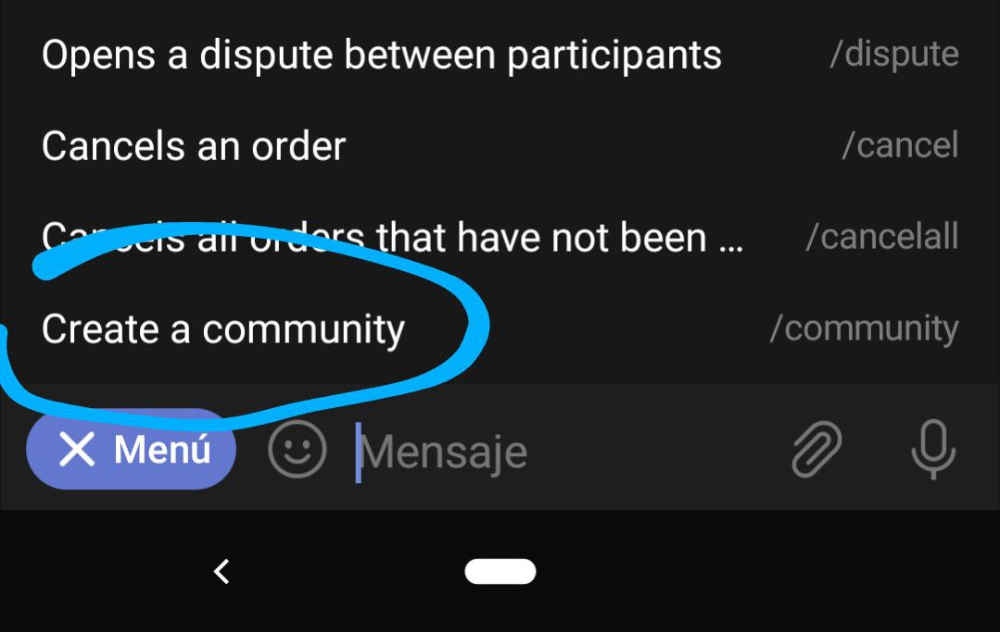

# بیایید شروع به ایجاد یک کامیونیتی کنیم. گام‌های اول

برای ایجاد یک کامیونیتی، باید دستور `community/` را از در ربات تایپ یا انتخاب کنید. از آنجا به بعد، ربات شما را در این فرآیند راهنمایی می کند.

[در این پست، جزئیات آورده شده](how-do-i-create-a-community.md), برای درک بهتر توجه به این نکته مهم است که هم شما و هم ربات باید در گروه تلگرامی کامیونیتی و کانال‌های مرتبط با آن ادمین(مدیر) باشید.
