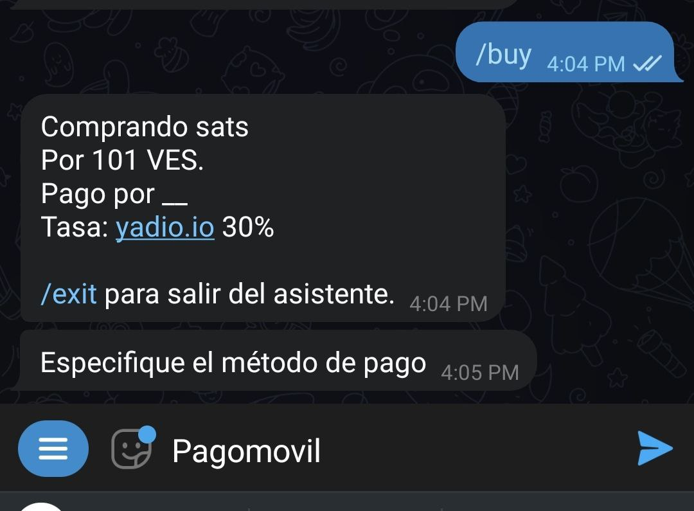
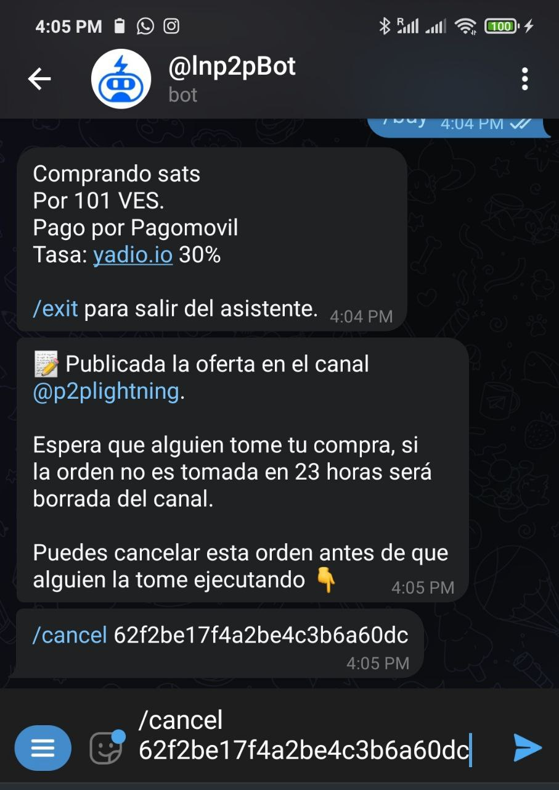
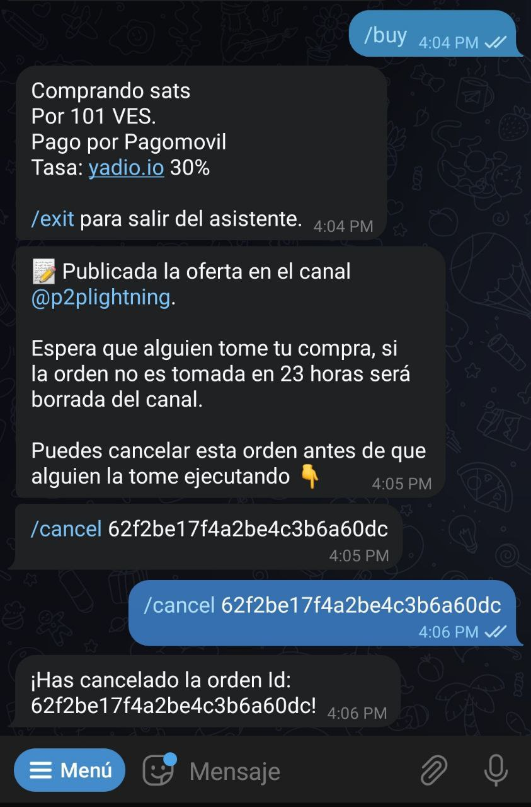

# چگونه یک سفارش خرید ایجاد کنم؟

روند کار دقیقاً مشابه ثبت سفارش فروش است. پس از باز کردن ربات و زدن دکمه "Menu" به جای `sell/`، دستور `buy/` را انتخاب کنید. این کار حالت wizard را فعال کرده و شما را در فرآیند خرید راهنمایی می‌کند.

پس از فعال‌سازی، wizard از شما می‌خواهد ارز فیات را که می‌خواهید با آن معامله کنید را مشخص کنید:

در مرحله بعد، مبلغی را که می خواهید بخرید، به ارز فیات وارد کنید. به یاد داشته باشید که در این مرحله فقط عدد وارد کنید(نه حروف یا کاراکتر) تا wizard بتواند متوجه شود.

همچنین می توانید با جدا کردن اعداد با خط تیره (-) محدوده‌ای از مقادیر را برای خرید وارد کنید.

حالا wizard مبلغی را که می‌خواهید دریافت کنید به ساتوشی از شما می‌خواهد. اینجا می‌توانید از گزینه "Market Price" استفاده کنید. اگر این کار را انجام دهید، نرخ را از سایت [Yadio.io](https://yadio.io/) گرفته و اعمال می‌کند.(بر حسب نرخ لحظه‌ای سایت تعداد ساتوشی ها را خودش حساب میکند)

در مرحله بعد، wizard درصد تخفیف یا حباب(premium or discount) مورد نظر شما در مبادله را درخواست خواهد کرد. اگر می‌خواهید سفارش‌تان با فی بالاتر از نرخ لحظه‌ای بازار ثبت شود، premium را که یه عدد مثبت و برحسب درصد است افزایش دهید. اگر می‌خواهید سفارش‌تان با فی پایین‌تر از نرخ لحظه‌ای بازار ثبت شود، discount را که یک عدد منفی و برحسب درصد است کاهش دهید(منفی‌تر کنید). اگر هیچ کدام را نمی‌خواهید، از گزینه "No premium or discount" استفاده کنید.

سپس باید روش پرداخت را مشخص کنید. در اینجا، می‌توانید خلاقیت به خرج دهید و ایموجی‌ها یا هر چیزی که احساس می‌کنید پیشنهاد شما را جذاب می‌کند، اضافه کنید. مثلا اگر قرار است وجه فیات را کارت به کارت کنید میتوانید بنویسید "کارت به کارت" یا اگر دلار نقدی میدهید بنویسید "دلار تحویل تهران". همچنین از تتر، حواله ساتنا، سکه فیزیکی و... نیز میتوانید استفاده کنید.

ربات پیشنهاد شما را در کانال عمومی یا کانالی که به عنوان پیش فرض برای کامیونیتی‌تان ایجاد شده منتشر می‌کند. این سفارش حداکثر 23ساعت در کانال خواهد ماند تا اگر کسی مایل بود آن را بردارد و با شما وارد معامله شود.

با استفاده از دستور `cancel/` و به دنبال آن وارد کردن شناسه سفارش، هر موقع بخواهید می‌توانید پیشنهاد را لغو کنید، مشروط بر اینکه کسی آن را قبول نکرده باشد. این دستور را در چت گروه یا چت شخصی‌تان با ربات می‌توانید وارد کنید.

پس از آن wizard پیامی مبنی بر تایید لغو ارسال می‌کند و سفارش شما از کانال سفارشات حذف می‌شود.

اگر سفارش شما توسط شخصی برداشته شود، wizard از شما می‌خواهد که یک فاکتور شبکه لایتنینگ با مبلغ مربوطه بر حسب ساتوشی ارائه دهید. به طور همزمان، از طرف مقابل شما می‌خواهد که فاکتور دیگری را پرداخت کند.
در این مرحله، ربات با دادن نام کاربری طرف مقابل به طرفین، هر دو طرف را به هم متصل می‌کند تا در مورد جزئیات پرداخت صحبت کنند.(باید به پیوی شخص مقابل رفته و با او گفتگو کنید)

هنگامی که پرداخت وجه فیات را انجام دادید، با دستور `fiatsent/` به ربات اطلاع دهید. ربات به همتای شما اطلاع می‌دهد تا دریافت وجه را بررسی و تایید کند و اقدام به آزادسازی ساتوشی‌ها کند. به یاد داشته باشید، کیف پول شما باید آنلاین باشد تا بتوانید ساتوشی‌ها را دریافت کنید.

مبادله تکمیل شد. اکنون می‌توانید به همتای خود امتیاز دهید.(بر حسب سرعت عمل در پاسخگویی، طرز برخورد و موارد دیگر) به یاد داشته باشید که امتیاز شما می‌تواند مبنای تصمیم گیری‌ کاربران دیگر در انتخاب سفارشات آینده شما(و همچنین همتایتان) باشد، پس صادقانه رفتار کنید.

با اجرای دستور `exit/` می توانید در هر زمان از ویزارد خارج شوید.

برای اجرای همان سفارش خرید بدون استفاده از حالت wizard، باید جزئیات سفارش خود را به ترتیب بنویسید:
`/buy` <satoshi amount> <fiat_amount> <fiat_code> <payment_method> [premium/discount] (without special characters).

### به مثال‌های زیر توجه کنید:

 مثال1: خرید صد هزار ساتوشی به مبلغ 50$. پرداخت دلار حضوری تهران. 

- Ex1: `/buy 100000 50 usd "tahvil hozuri tehran"`

 مثال2: خرید پانصد هزار تومان ساتوشی به نرخ لحظه‌ای بازار با پرداخت از طریق کارت به کارت. 

- Ex2: `/buy 0 500000 irt "kart be kart"`
 
 مثال3: خرید 15-20 میلیون تومان ساتوشی به نرخ لحظه‌ای. پرداخت با حواله ساتنا. در این مثال فروشنده بسته به مقدار ساتوشی ای که میخواهد بفروشد عددی را بین 15-20 میلیون تومان تعیین میکند و ربات سپس به میزان تعین شده از خریدار درخواست فاکتور لایتنینیگی میکند. 

- Ex3: `/buy 0 15000000-20000000 irt "havale Satna"`

 مثال4: خرید مقدار 200$ ساتوشی با 3% تخفیف(زیر نرخ لحظه‌ای بازار). در این حالت ربات با دیدن 3- از نرخ بازار 3درصد کم و مبلغ را به فروشنده اعلام می‌کند. شیوه پرداخت نیز ارسال تتر(معادل همان 200$) توسط خریدار می‌باشد. 

- Ex4: `/buy 0 200 usd "mobile payment" -3`

اگر متغیر ناسازگاری وجود داشته باشد، ربات آن را در طول فرآیند ایجاد سفارش نشان داده و خطا میدهد. سفارش پس از تکمیل، به طور خودکار در کانال تبادل منتشر می‌شود و برای مدت 23 ساعت برای عموم قابل مشاهده خواهد بود.
