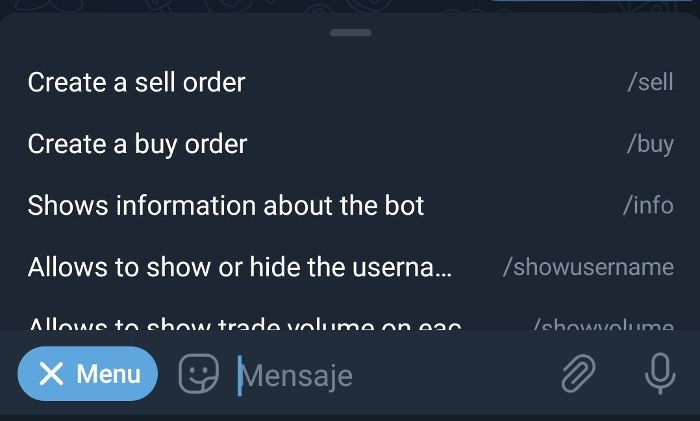

# How do I create a sell order?

When chatting with [@lnp2pBot](https://t.me/lnp2pbot) you will find a "Menu" button. Click it to display the list of commands you can use. Select the sell command: `/sell`, to activate the wizard that will guide you through the selling process.

Once activated, the wizard will ask you to specify the fiat currency in which you want to trade:

Next, you must enter the amount, in fiat currency, that you want in exchange for your satoshis. Remember to enter only numbers in this step, so that the wizard can understand you.

You can also enter a range of amounts to buy, separating the numbers by a hyphen (-).

The bot will ask you the amount, in satoshis, you want to deliver. Here you have the possibility to use the "Market price" button. If you do so, the rate of [Yadio. io](https://yadio.io/) will be applied.

The next thing the wizard prompts you for is the percentage premium or discount you want on your swap. If you want to increase the market rate (premium), select a positive number; if you want to decrease it (discount), select a negative number. If you want neither, use the "No premium or discount" button.

Next, you will need to specify the payment method. In this field, you can get creative and add emoticons or whatever you consider to make your request attractive.

The bot will proceed to publish your offer in the general or community channel you have set as default. It will remain visible for 23 hours if no one takes it before that time.

At any time you can cancel the offer, as long as no one has taken it, using the command `/cancel` followed by the order identifier. You can also copy the command plus the identifier in the chat with the bot.

The wizard will return a message confirming the cancellation and your offer will be removed from the offers channel.

In case your sale is taken, the bot will ask your counterparty to deliver a Lightning Network invoice.

At the same time, it will ask you to pay the invoice with the corresponding amount in satoshis, plus a 0.6% commission. Remember that the network may charge you an additional amount for payment routing. This amount will depend on the nodes through which your transaction will pass and the network status. The bot has nothing to do with this amount.

At this point, the bot will contact both parties to discuss the details of the exchange.

Once the bot receives notice that the fiat amount was paid, it sends you an alert to check your account. If everything is in order, you can release the satoshis with the command `/release` followed by the transaction identifier (or copy and paste the text into the bot chat) and the transaction will be executed.

The exchange is finished. Now you can rate your counterparty.

You can exit the wizard at any time by executing the `/exit` command.

To execute the same sell order, without using the wizard, you must type your order with the details: `/sell <amount in sats> <amount in fiat> <fiat code> <payment method> [premium/discount]` (without the special characters).

Example: `/sell 100000 50 USD "bank xyz"` I sell one hundred thousand sats at fifty dollars I charge by bank xyz.

In case there is any unsupported variable, the bot will indicate it to you during the order creation process. Once completed, the order will be published in the exchange channel and will be visible for a period of 23 hours.