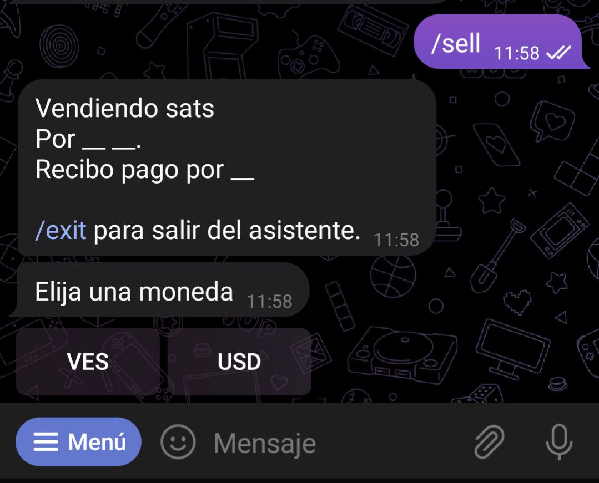

# چگونه سفارشات را در یک کامیونیتی پست کنم؟

وقتی شروع به استفاده از [@lnp2pBot](https://t.me/lnp2pbot) می کنید، سفارشاتی که ثبت می‌کنید به طور پیش فرض در کانال [https://t.me/p2plightning](https://t.me/p2plightning) پست می‌شوند، این کانال جهانی است که در آن می‌توان سفارشاتی را با ارزهای متفاوت از کشورهای مختلف پیدا کرد.

اگر می‌خواهید سفارشات را در کانالی مخصوص واحد پول خود پست کنید، باید این کار را از طریق [انجمن](./communities.md) انجام دهید که آن ارز در آنجا استفاده می‌شود.

- می‌توانید در [https://market.lnp2pbot.com](https://market.lnp2pbot.com) همه کامیونیتی‌هایی که با ارز مورد نظر شما کار می‌کنند را جستجو کنید.

- همچنین می توانید در ربات تایپ کنید:

`/findcomms <fiat code>`

به عنوان مثال، `findcomms irt/` برای جستجوی همه کامیونیتی‌های که با IRT(تومان ایران) معامله می‌کنند استفاده می‌شود. اگر نماد ارز خود را نمی دانید، `listcurrencies/` را در ربات تایپ کنید و آن را پیدا کنید.

با انتخاب یک کامیونیتی، ربات تعداد سفارشات موفق، حجم معاملات انجام شده در 24 ساعت گذشته و تعداد کاربرانی که پیشنهادات خود را در آنجا ارسال می‌کنند را نمایش می‌دهد. برای تعیین اینکه می‌خواهید پیشنهادات خود را در کدام انجمن منتشر کنید، باید دکمه "Use as default"(انتخاب به عنوان پیشفرض) را انتخاب کنید.

- راه دیگر برای انجام این کار وارد کردن آیدی گروه تلگرامی کامیونیتی با دستور زیر است:
- `<setcomm <@communityGroupName | telegram-group-id/`
- (`setcomm` along with the group name or its Telegram ID/).

برای ثبت سفارش در یک انجمن، بسته به آنچه می‌خواهید، از دستور `buy/` یا `sell/` استفاده کنید. از آنجا ربات دستورالعمل‌های مرحله به مرحله را به شما ارائه می‌دهد و سفارش شما در انجمن انتخاب شده منتشر می‌شود.

## اطلاعات بیشتر:

- شما می‌توانید هر بار فقط یک کامیونیتی را به صورت پیش فرض انتخاب کنید و بنابراین، تمام پیشنهادات شما در آنجا پست می‌شود.

- برای ترک یک کامیونیتی و ارسال مجدد پیشنهادات در [کانال عمومی](https://t.me/p2plightning)، باید تایپ کنید:
  `setcomm off/`

- اگر می‌خواهید پیشنهادی را در چندین کامیونیتی به طور همزمان پست کنید، باید آن را در هر یک به طور جداگانه ایجاد کنید: ابتدا آن را در یکی پست کنید، سپس کامیونیتی دیگری را به عنوان پیش‌فرض انتخاب کنید و در آنجا نیز پست کنید، و به همین ترتیب برای همه کامیونیتی‌هایی که می‌خواهید سفارش را در آن ارسال کنید.

راه دیگر این است که سفارش خود را به عنوان یک دستور در چت کامیونیتی که ربات در آن مدیر است تایپ کنید، به این صورت ربات آن را تشخیص داده و بدون نیاز به تنظیم آن به عنوان پیش فرض، سفارش را در آن انجمن ارسال می‌کند.

-می‌توانید از هر تعداد کامیونیتی که می‌خواهید پیشنهاد دریافت کنید، بدون اینکه نیازی به پیکربندی هیچ یک از آنها به عنوان پیش‌فرض باشد.
