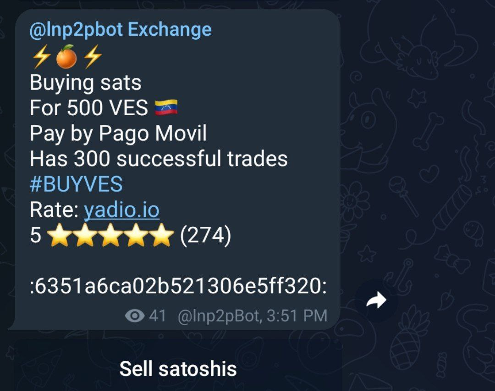

# سیستم امتیازسنجی کاربر چگونه کار می‌کند؟

برای هر تراکنشی که انجام می‌دهید، از شما خواسته می‌شود به همتای خود امتیاز دهید، و آنها نیز به شما امتیاز می‌دهند. [**lnp2pBot**](https://t.me/lnp2pBot) از یک سیستم رتبه‌بندی 5 ستاره استفاده می‌کند که به شما امکان می‌دهد تجربه خود را ارزیابی کنید، در اینجا 1 ستاره کمترین امتیاز و 5 ستاره بالاترین است.
برای تعیین شهرت(اعتبار)، ربات یک محاسبه تکراری بر حسب میانگین و انحراف معیار استاندارد رتبه‌بندی‌ها و عملیات‌های موفق انجام می‌دهد. از این رو، در معاملات اولیه، حتی اگر با حداکثر امتیاز را گرفته باشید، شهرت شما به سرعت بالا نخواهد رفت. با انجام سفارشات موفق بیشتر با امتیاز خوب، شهرتتان به تدریج افزایش می‌یابد.

می توانید روش این محاسبه را در آدرس زیر مشاهده کنید: [https://github.com/lnp2pBot/bot/blob/main/bot/commands.js#L279](https://github.com/lnp2pBot/bot/blob/main/bot/commands.js#L279)

این بر اساس لینک زیر است:
[https://math.stackexchange.com/questions/2148877/iterative-calculation-of-mean-and-standard-deviation](https://math.stackexchange.com/questions/2148877/iterative-calculation-of-mean-and-standard-deviation)

وقتی سفارشی ثبت می‌کنید، به‌طور پیش‌فرض تعداد عملیات‌های موفقی که انجام داده‌اید، امتیازات دریافت‌شده از همتایان پیشین‌تان و تعداد عملیات‌های انجام‌شده را شامل می‌شود. برای جلوگیری از کلاهبرداری، توصیه می‌کنیم هنگام پذیرش سفارش نیز تمام این جنبه‌ها را در نظر بگیرید و با کاربران خوش شهرت‌تر وارد معامله شوید.

