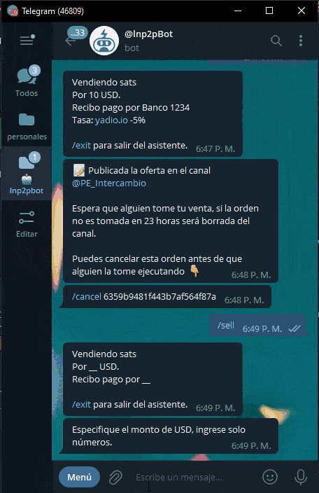

# ربات نرخ تبدیلی ارز را از کجا می‌آورد؟

هنگام ایجاد یک سفارش، می‌توانید انتخاب کنید که، فقط مبلغ فیات را برای `پرداخت/دریافت` مشخص کنید، بدون نیاز به وارد کردن ساتوشی‌هایی که می‌خواهید `خرید/فروش` کنید. در این حالت، باید دکمه `Market Price` را انتخاب کنید. اینگونه ربات خودش نرخ بازار ارائه شده توسط [yadio.io](https://yadio.io/) را در لحظه ثبت سفارش‌تان مبنای محاسبه تعداد ساتوشی‌ها قرار می‌دهد.

وقتی دکمه `Market Price` را انتخاب می‌کنید، می‌توانید برای پیشنهاد خود حباب/تخفیف تعیین کنید. این بدان معناست که در زمان دریافت سفارش، افزایش یا کاهشی برای قیمت بیتکوین که در [yadio.io](https://yadio.io/) نشان داده شده اعمال می‌شود.

#### مثال‌های کاربردی با معانی آنها:

  
- خرید ساتوشی %1+: من می‌خواهم بیتکوین را **%1 گران‌تر** از (بالای) قیمت BTC نشان داده شده توسط [yadio.io](https://yadio.io/) در زمانی که کسی سفارش من را می‌پذیرد، بخرم.
- خرید ساتوشی %5-: من می‌خواهم بیتکوین را **%5 ارزان‌تر** از (زیر) قیمت BTC نشان داده شده توسط [yadio.io](https://yadio.io/) در زمانی که کسی سفارش من را می‌پذیرد، بخرم.
- فروش ساتوشی %3+: من می‌خواهم بیتکوین را **3٪ گرانتر** از (بالای) قیمت BTC نشان داده شده توسط [yadio.io](https://yadio.io/) در زمانی که کسی سفارش من را می‌پذیرد، بفروشم.
- فروش ساتوشی %4-: من می‌خواهم بیتکوین را **%4 ارزان‌تر** از (زیر) قیمت BTC نشان داده شده توسط [yadio.io](https://yadio.io/) در زمانی که کسی سفارش من را می‌پذیرد، بفروشم.

