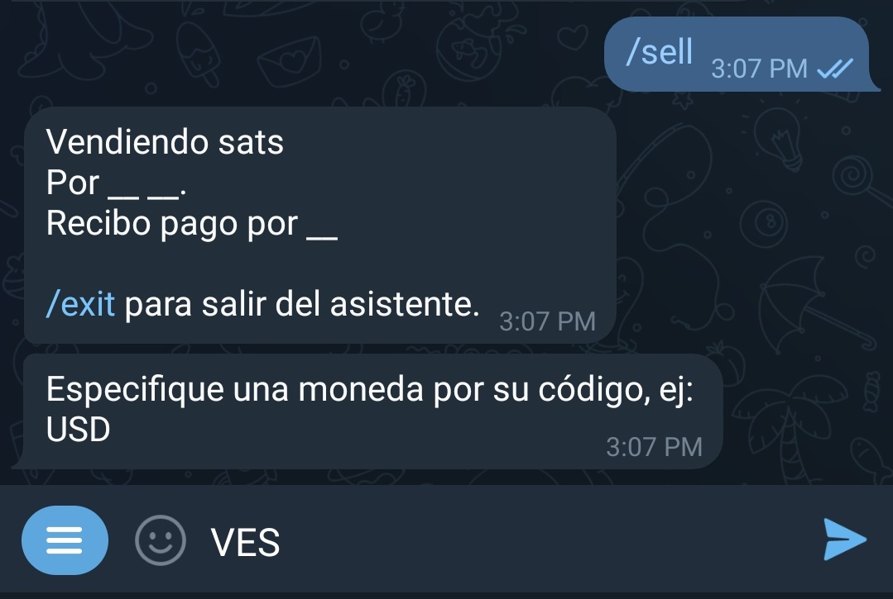
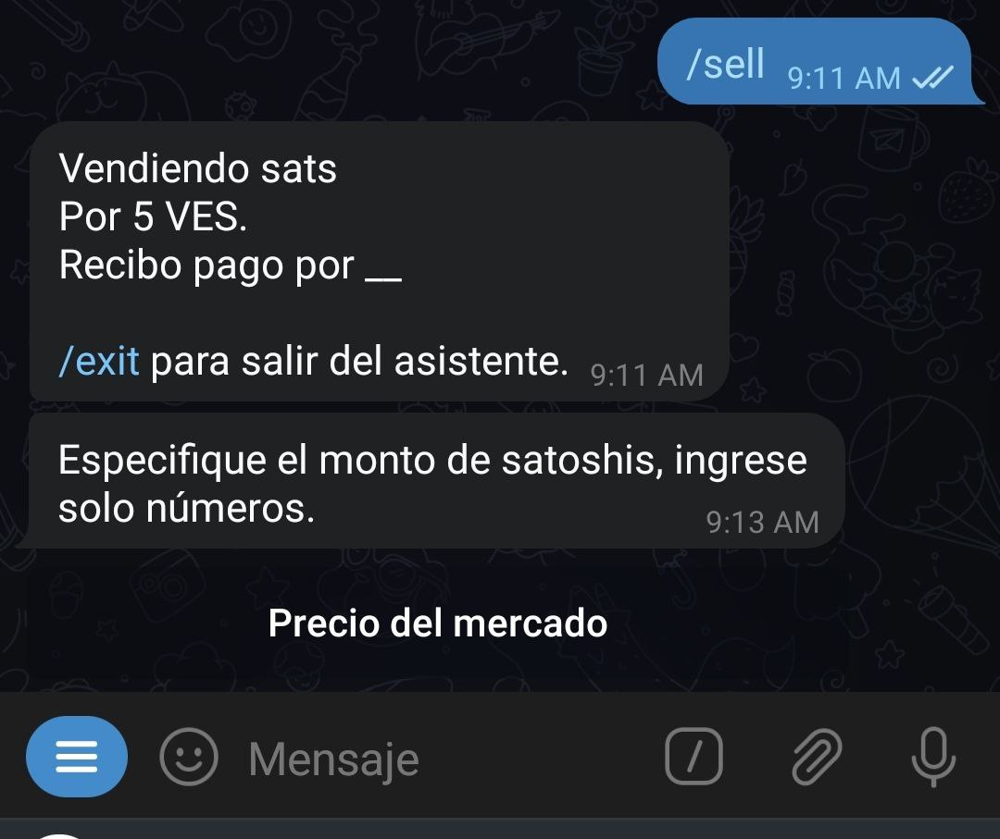
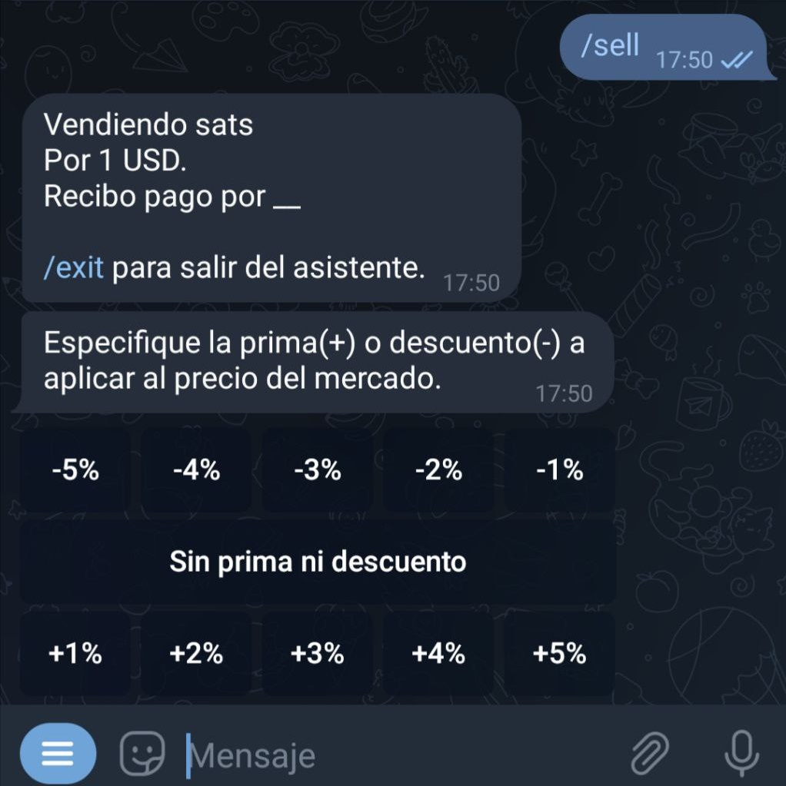
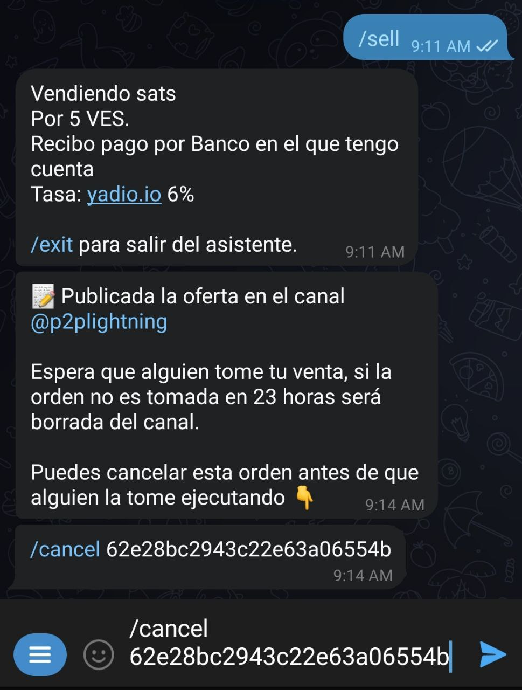
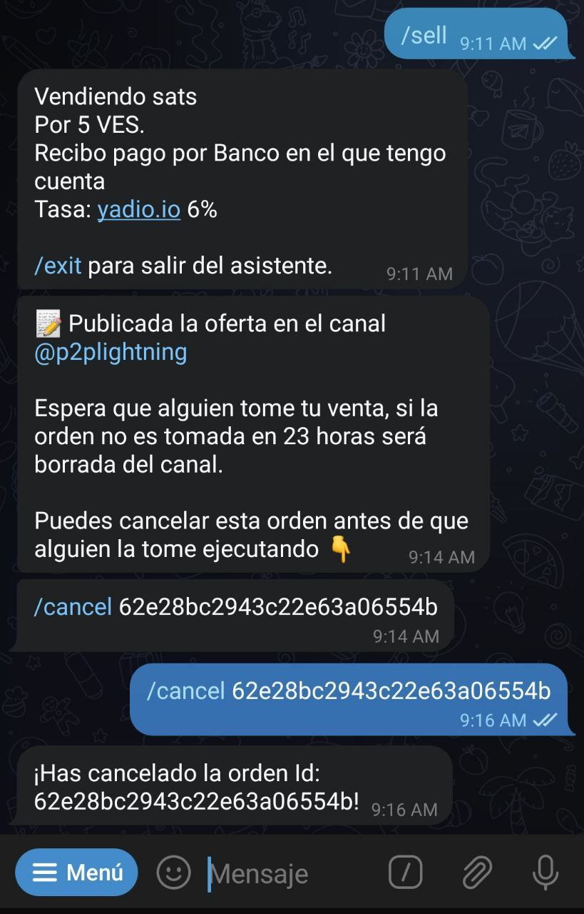

# Comment créer une offre de vente ?

Lorsque vous discutez avec [@lnp2pBot](https://t.me/lnp2pbot), vous trouverez un bouton "Menu". Cliquez dessus pour afficher la liste des commandes que vous pouvez utiliser. Sélectionnez la commande de vente : `/sell`, pour activer l'assistant qui vous guidera à travers le processus de vente.

Une fois activé, l'assistant vous demandera de spécifier la monnaie fiat dans laquelle vous souhaitez effectuer des transactions :

Ensuite, vous devez saisir le montant, en monnaie fiat, que vous souhaitez obtenir en échange de vos satoshis. N'oubliez pas de ne saisir que des chiffres à cette étape, afin que l'assistant puisse vous comprendre.

Vous pouvez également saisir une fourchette de montants à acheter, en séparant les chiffres par un trait d'union (-).

Le bot vous demandera le montant, en satoshis, que vous souhaitez vendre. Vous avez la possibilité d'utiliser le bouton "Prix du marché". Si vous le faites, le taux de [Yadio. io] (https://yadio.io/) sera appliqué.

L'assistant vous demande ensuite le pourcentage de surcote ou de décote que vous souhaitez appliquer à votre opération. Si vous souhaitez vendre au-dessus du taux du marché (surcote), sélectionnez un nombre positif ; si vous souhaitez vendre en-dessous (décote), sélectionnez un nombre négatif. Si vous ne voulez ni l'un ni l'autre, utilisez le bouton "Pas de surcote ou de décote".

Ensuite, vous devez spécifier le mode de paiement. Dans ce champ, vous pouvez faire preuve de créativité et ajouter des émoticônes ou tout autre élément susceptible de rendre votre demande attrayante.

Le bot publiera votre offre dans le canal général ou communautaire que vous avez défini par défaut. Elle restera visible pendant 23 heures si personne ne l'accepte avant ce délai.

Vous pouvez à tout moment annuler l'offre, tant que personne ne l'a acceptée, en utilisant la commande `/cancel` suivie de l'ID de la commande. Vous pouvez également copier la l'offre et l'ID dans le chat avec le bot.

L'assistant retournera un message confirmant l'annulation et votre offre sera supprimée du canal des offres.

Si votre offre de vente est acceptée, le bot demandera à votre contrepartie de lui remettre une facture du Lightning Network.

En même temps, il vous demandera de payer la facture avec le montant correspondant en satoshis, plus une commission de 0,6 %. N'oubliez pas que le réseau peut vous facturer un montant supplémentaire pour l'acheminement du paiement. Ce montant dépend des nœuds par lesquels passe votre transaction et de l'état du réseau. Le bot n'a rien à voir avec ce montant.

À ce stade, le bot contactera les deux parties pour discuter des détails de l'échange.

Une fois que le bot a été informé que le montant en fiats a été payé, il vous envoie une alerte pour que vous vérifiiez votre compte. Si tout est en ordre, vous pouvez libérer les satoshis avec la commande `/release` suivie de l'ID de la transaction (ou copier et coller le texte dans le chat du bot) et la transaction sera exécutée.

L'échange est terminé. Vous pouvez maintenant évaluer votre contrepartie.

Vous pouvez quitter l'assistant à tout moment en exécutant la commande `/exit`.

Pour exécuter le même ordre de vente, sans utiliser l'assistant, vous devez taper votre ordre avec les informations suivantes : `/sell <montant en sats> <montant en fiat> <code fiat> <mode de paiement> [premium/discount]` (sans les caractères spéciaux).

Exemple : `/sell 100000 20000 XOF "Société Géniale Bank"` Je vends 100.000 sats à 20.000 F que je reçois via Société Géniale Bank.

Si une variable n'est pas prise en charge, le robot vous l'indiquera au cours du processus de création de l'offre. Une fois terminé, l'ordre sera publié sur le canal d'échange et sera visible pendant une période de 23 heures.
