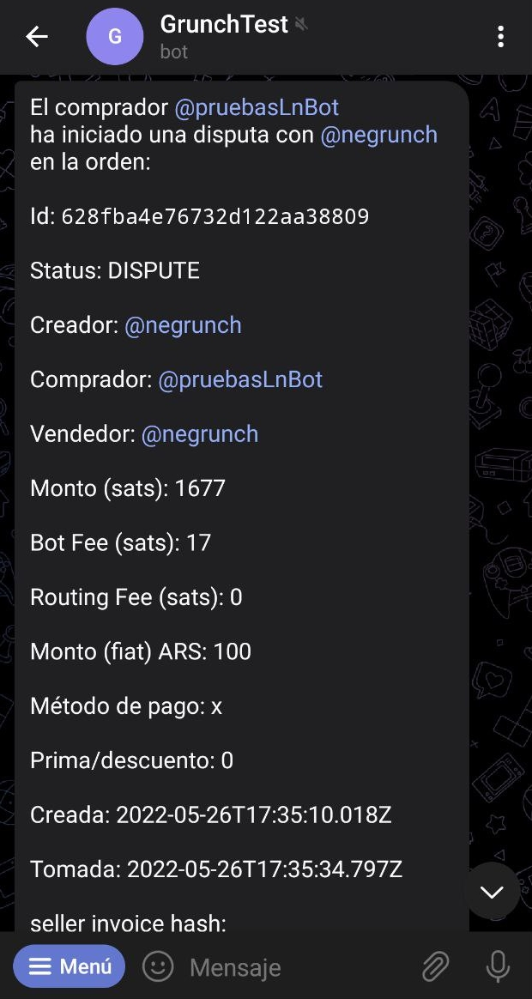

# Résolution des litiges

Lorsqu'un utilisateur lance un litige, un message est envoyé par le bot au canal des litiges. Seuls les **médiateurs** peuvent s'en saisir en appuyant sur le bouton **Prendre le litige**. Avant de prendre un litige, le médiateur doit s'assurer qu'il/elle a configuré la communauté, pour configurer la communauté, le solver doit exécuter la commande `/setcomm @community-group`.

Une fois que le médiateur a saisi le litige, le bot lui envoie toutes les informations nécessaires pour le résoudre. Le résolveur devra également communiquer avec chaque partie, comprendre ce qui s'est passé et **valider** la commande ou **l'annuler**.

