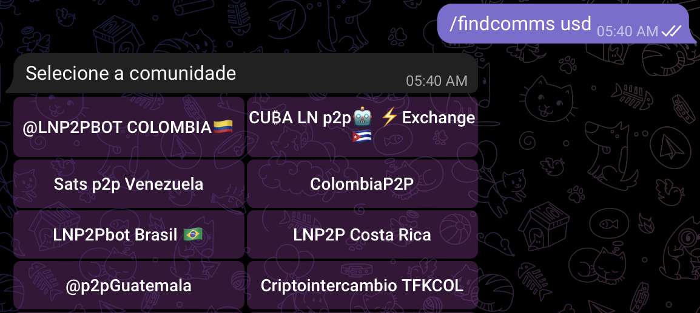
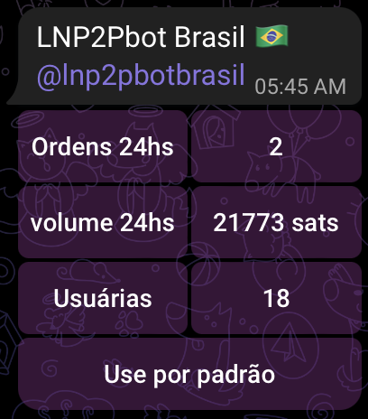
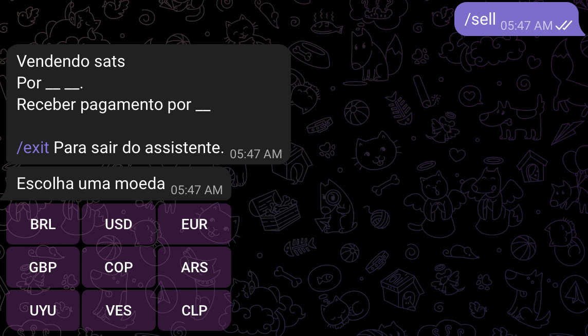

# Como comprar em uma comunidade específica?

Uma vez que você executou o comando `/findcomms *<código da moeda>*` para encontrar todas as comunidades que operam na moeda desejada,

Basta selecionar a comunidade em que deseja participar e o bot mostrará a quantidade de pedidos bem-sucedidos e o volume de comércio negociado nas últimas 24 horas nessa comunidade, abaixo vemos um botão que diz "Definir como padrão", ao tocar nesse botão você já está participando.

Para criar um pedido, use o comando `/buy` ou `/sell`, dependendo do que você deseja. A partir daí, o robô dará as instruções passo a passo.

Para sair da comunidade, use o comando `/setcomm off`.
