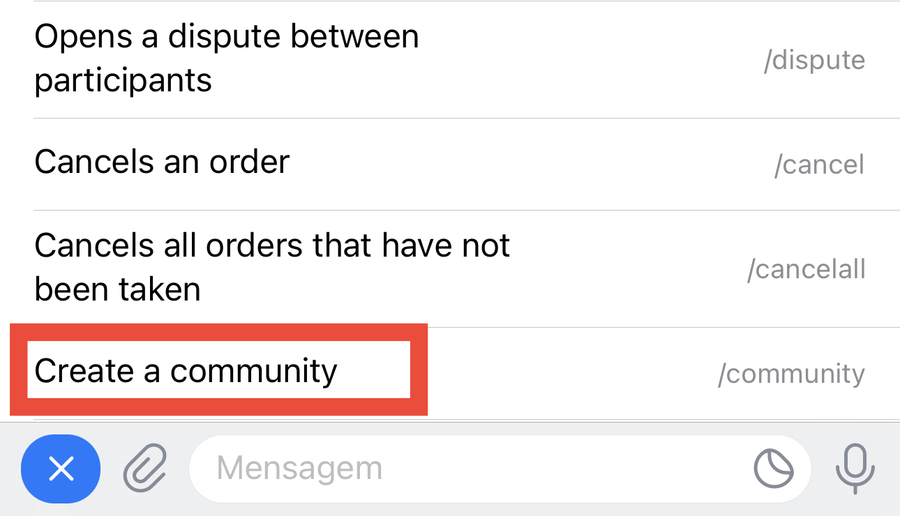

# Mãos à obra. Comunidades, primeiros passos

Para criar uma comunidade, devemos digitar ou selecionar o comando `/community` no menu. A partir daí, o bot irá guiá-lo no processo.

[Nesta entrada estão os detalhes](how-do-i-create-a-community.md), para melhor compreensão. É importante que você saiba que tanto você quanto o bot devem ser administradores tanto no grupo da comunidade quanto nos canais vinculados a ela.
