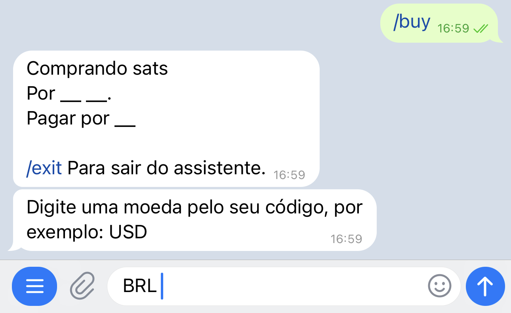
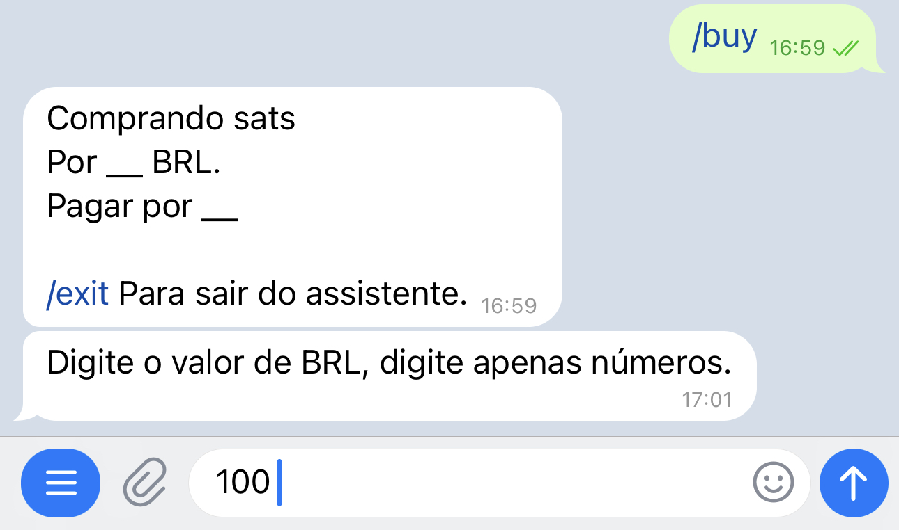
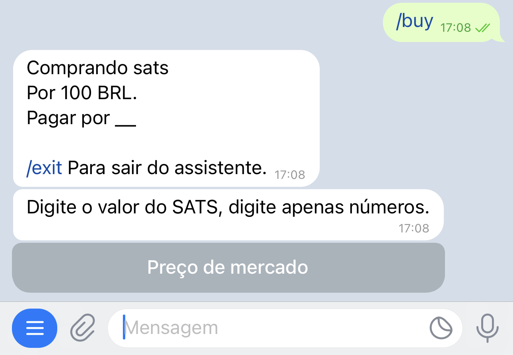
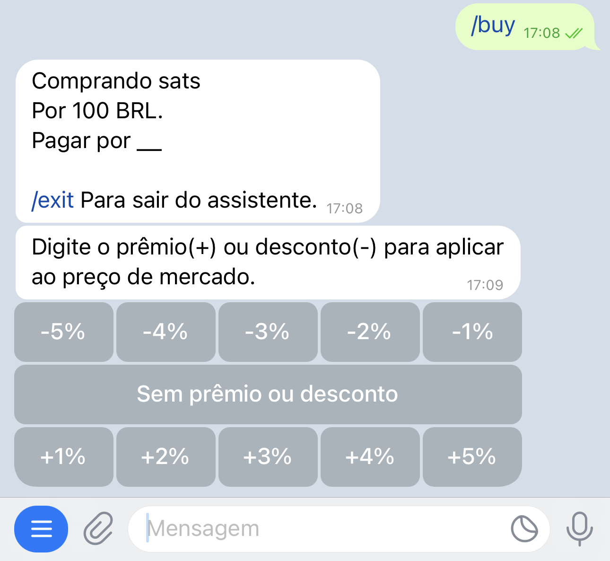
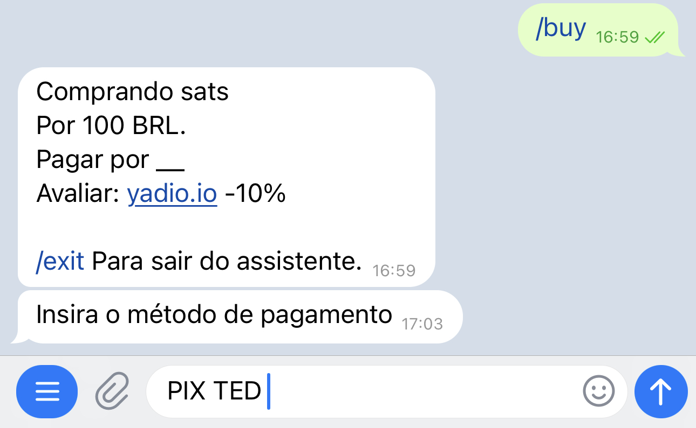
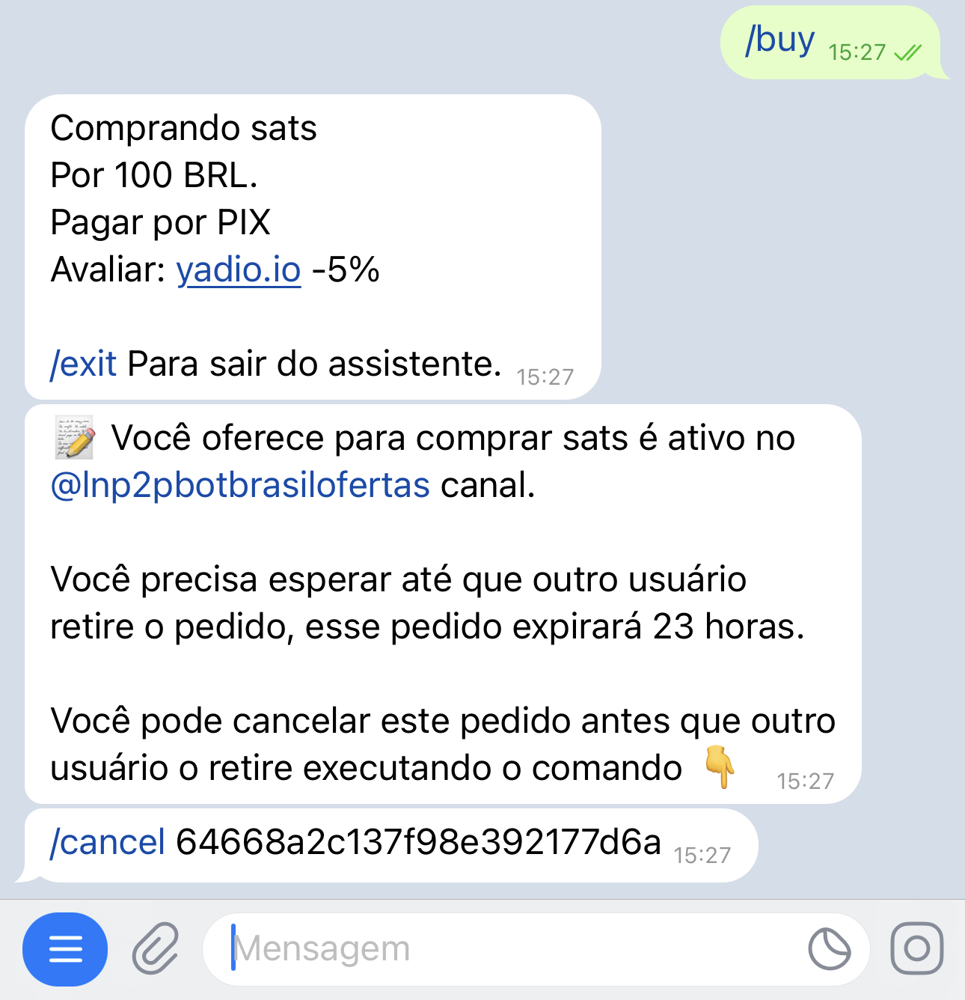
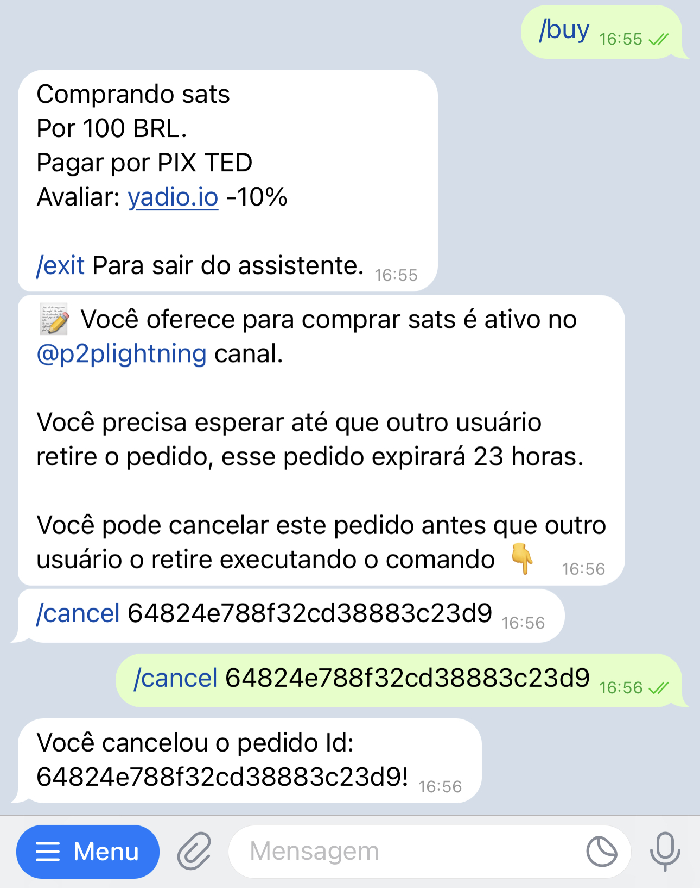

# Como criar um pedido de compra?

O procedimento é exatamente o mesmo que para o pedido de venda. Só que, ao pressionar o botão "Menu", você deve selecionar o comando `/buy` em vez de `/sell`. Isso ativará o assistente que irá guiá-lo pelo processo de compra.

Uma vez ativado, o assistente pedirá que você especifique a moeda fiduciária com a qual deseja negociar:

Em seguida, você deverá inserir o valor, em moeda fiduciária, que deseja comprar. Lembre-se de inserir apenas números neste passo, para que o assistente possa entender.

Você também pode inserir uma faixa de valores a comprar, separando os números por um hífen (-).

O assistente perguntará pelo valor, em satoshis, que deseja receber. Aqui, você tem a opção de usar o botão "Preço de Mercado". Se selecionar, será aplicada a taxa da [Yadio.io](https://yadio.io/).

O próximo passo que o assistente pede é a porcentagem de ágio ou desconto desejada na sua troca. Se desejar aumentar a taxa de mercado (ágio), selecione um número positivo; se desejar diminuí-la (desconto), selecione um número negativo. Se não desejar nenhum, use o botão "Sem ágio ou desconto".

Em seguida, você deverá especificar o método de pagamento. Neste campo, você pode ser criativo e adicionar emojis ou o que achar atrativo para a sua oferta.

O bot irá publicar sua oferta no canal geral ou na comunidade que você configurou como padrão. Ela permanecerá visível por 23 horas, caso não seja aceita antes desse prazo.

A qualquer momento, você pode cancelar a oferta, desde que ninguém a tenha aceitado, utilizando o comando `/cancel` seguido pelo identificador do pedido. Você também pode copiar o comando junto com o identificador no chat com o bot.

O assistente enviará uma mensagem confirmando o cancelamento e sua oferta será removida do canal de ofertas.

Se sua oferta for aceita, o assistente solicitará que você emita uma fatura na Lightning Network com o valor em satoshis correspondente. Ao mesmo tempo, pedirá à sua contraparte que pague a fatura.

Neste momento, o bot entrará em contato com ambas as partes para discutir os detalhes da troca.

Depois de efetuar o pagamento em moeda fiduciária, notifique o bot com o comando `/fiatsent`. O bot informará a sua contraparte para verificar o recebimento do dinheiro e procederá à liberação dos satoshis. Lembre-se de que sua carteira deve estar online para recebê-los.

A troca está completa. Agora, você pode avaliar sua contraparte.

Você pode sair do assistente a qualquer momento executando o comando `/exit`.

Para executar o mesmo pedido de compra, sem usar o assistente, você deve escrever seu pedido com os detalhes: `/buy` <valor em satoshis> <valor em fiduciário> <código fiduciário> <método de pagamento> [ágio/desconto] (sem caracteres especiais).

Exemplo: `/buy 100000 50 usd "banco xyz"`

Compro cem mil satoshis por cinquenta dólares, pagamento pelo banco xyz.

Alguns exemplos de pedidos de compra seriam:

- Ex. `/buy 0 50 ves "banco xyz"`: Compro cinquenta bolívares em satoshis - neste caso, o bot fará o cálculo com a taxa de mercado - pagamento pelo banco xyz
- Ex. `/buy 0 10-100 pen "pago móvel"`: Compro de 10 a 100 novos sóis - neste caso, o vendedor escolherá quanto deseja vender dentro dessa faixa - pagamento por pagamento móvel
- Ex. `/buy 0 100 eur "pago móvel" -3`: Compro 100 euros com desconto de 
