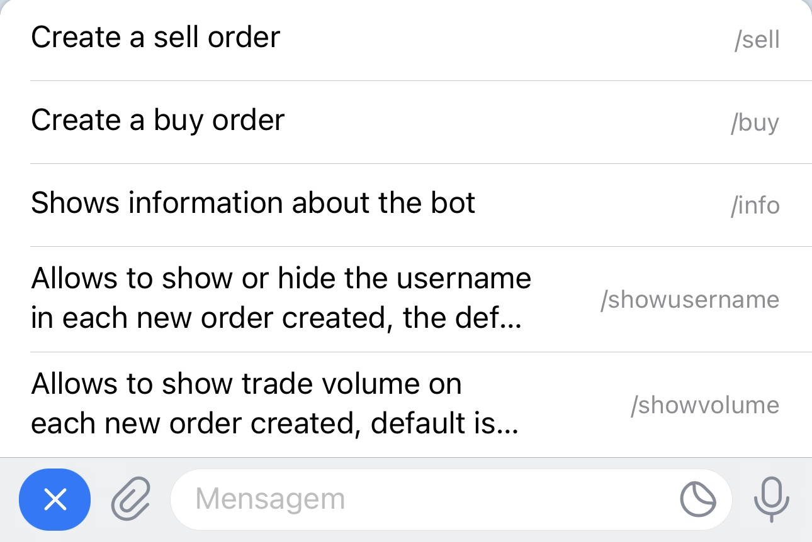
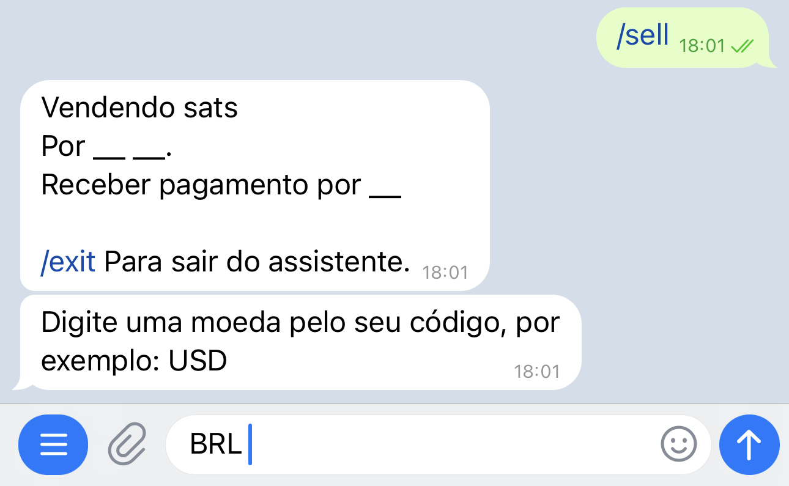
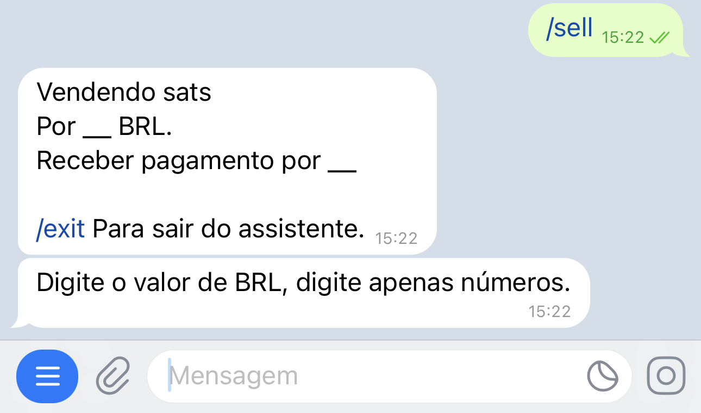
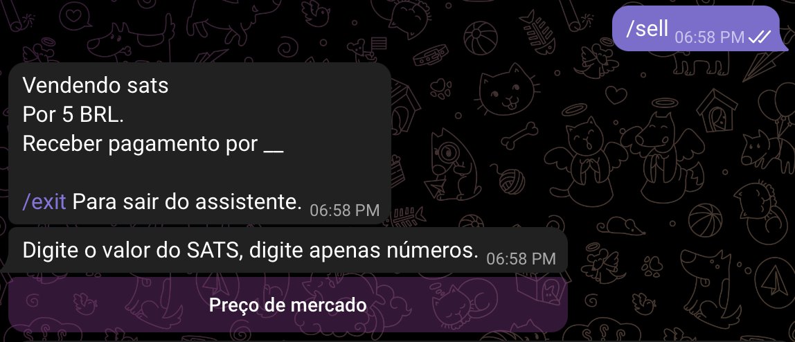
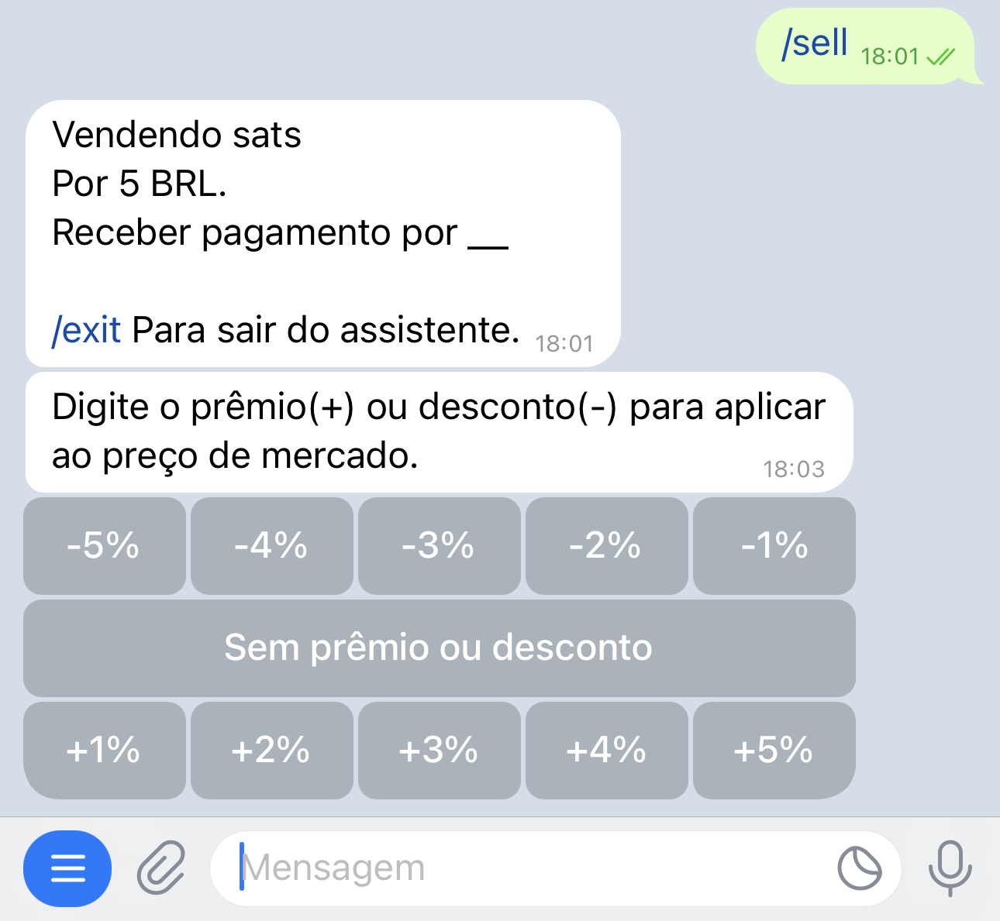
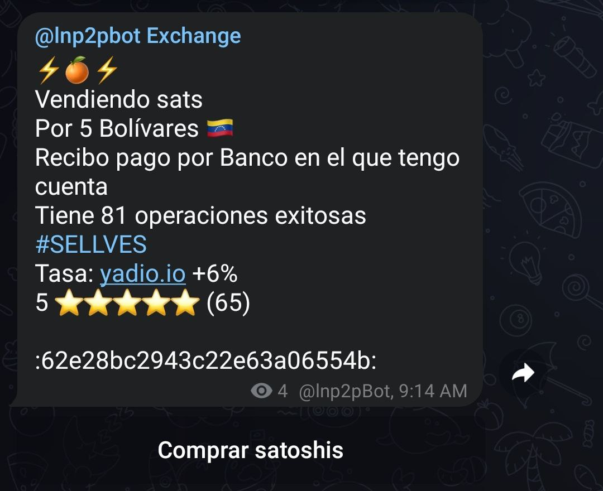
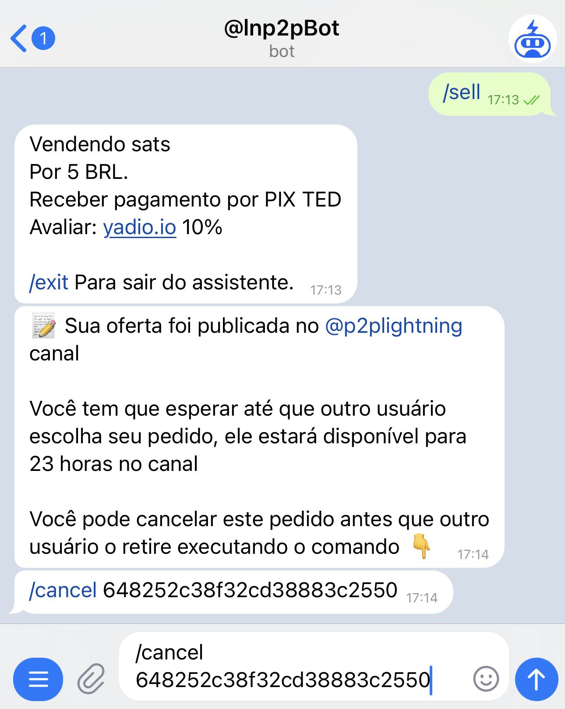
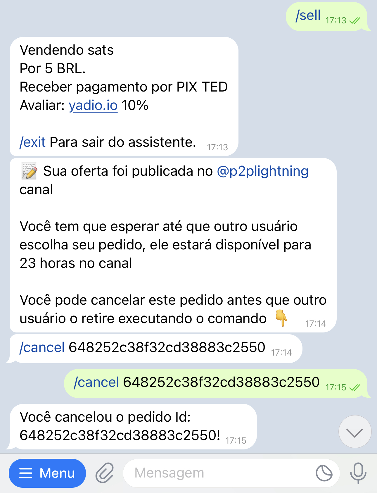

# Como criar uma ordem de venda?

Ao conversar com [@lnp2pBot](https://t.me/lnp2pbot), você encontrará um botão de "Menu". Clique nele para exibir a lista de comandos que você pode usar. Selecione o comando de venda: `/sell`, para ativar o assistente (*wizard*) que irá guiá-lo pelo processo de venda.

Uma vez ativado, o assistente solicitará que você especifique a moeda fiduciária na qual deseja negociar:

Em seguida, você deverá inserir o valor, em moeda fiduciária, que deseja em troca de seus satoshis. Lembre-se de inserir apenas números neste passo, para que o assistente possa entendê-lo.

Você também pode inserir um intervalo de quantidades a serem vendidas, separando os números por um hífen (-).

O bot perguntará o valor, em satoshis, que você deseja entregar. Aqui você tem a opção de usar o botão "Preço de mercado". Se você o utilizar, será aplicada a taxa do [Yadio.io](https://yadio.io/).

Em seguida, o assistente pedirá o percentual de ágio ou desconto que você deseja na sua transação. Se deseja aumentar a taxa de mercado (ágio), selecione um número positivo; se deseja diminuí-la (desconto), selecione um número negativo. Caso não queira nenhum, use o botão "Sem ágio ou desconto".

Depois, você deve especificar o método de pagamento. Neste campo, você pode ser criativo e adicionar emojis ou o que achar adequado para tornar sua oferta atraente.

O bot prosseguirá para publicar sua oferta no canal geral ou na comunidade que você configurou como padrão. Ela permanecerá visível por 23 horas, caso ninguém a aceite antes desse prazo.

A qualquer momento, você pode cancelar a oferta, desde que ninguém a tenha aceitado, usando o comando `/cancel` seguido pelo identificador da ordem. Você também pode copiar o comando com o identificador e enviá-lo no chat com o bot.

O assistente confirmará o cancelamento e removerá sua oferta do canal de ofertas.

Se a sua venda for aceita, o bot pedirá que sua contraparte entregue uma fatura da Lightning Network.

Ao mesmo tempo, ele pedirá que você pague a fatura no valor correspondente em satoshis, além de uma comissão de 0,6%. Lembre-se de que a rede pode cobrar uma taxa adicional pelo encaminhamento do pagamento. Esse valor dependerá dos nós pelos quais sua transação passará e das condições da rede. O bot não tem relação com esse valor.

Neste momento, o bot conectará ambas as partes para discutir os detalhes da troca.

Assim que o bot receber a confirmação de que o valor em moeda fiduciária foi pago, ele enviará um alerta para você verificar sua conta. Se estiver tudo correto, você pode liberar os satoshis com o comando `/release`, seguido do identificador da transação (ou copie e cole o texto no chat do bot) e a transação será executada.

A troca está concluída. Agora você pode avaliar sua contraparte.

Você pode sair do assistente a qualquer momento executando o comando `/exit`.

Para executar a mesma ordem de venda, sem usar o assistente, você deve digitar sua ordem com os detalhes: `/sell <valor em sats> <valor em fiduciário> <código fiduciário> <método de pagamento> [ágio/desconto]` (sem os caracteres especiais).

Exemplo: `/sell 100000 50 usd "banco xyz"` Vendo cem mil satoshis a cinquenta dólares, pagamento via banco xyz

Se houver alguma variável incompatível, o bot indicará durante o processo de criação da ordem. Após concluí-la, a ordem será publicada automaticamente no canal de troca e ficará visível por um período de 23 horas.
