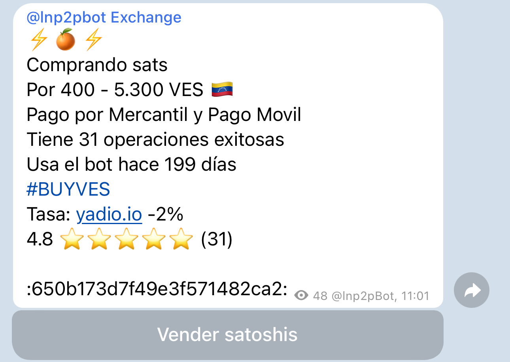

# Como funciona o sistema de reputação do usuário?

Para cada transação que você realizar, será solicitado que avalie seu parceiro, enquanto ele fará o mesmo com você. Para isso, o [**lnp2pBot**](https://t.me/lnp2pBot) conta com um sistema de classificação de 5 estrelas que permite que você avalie sua experiência, onde 1 estrela é a classificação mais baixa e 5 estrelas é a mais alta.

Para obter a reputação, o bot realiza um cálculo iterativo da média e do desvio padrão das classificações e transações bem-sucedidas. Portanto, nas primeiras transações, mesmo que você receba a classificação máxima, sua reputação não será alta, mas aumentará progressivamente à medida que realizar transações com boas avaliações.

Esse cálculo pode ser visualizado em: [https://github.com/lnp2pBot/bot/blob/main/bot/commands.js#L279](https://github.com/lnp2pBot/bot/blob/main/bot/commands.js#L279)

E está baseado em:
[https://math.stackexchange.com/questions/2148877/iterative-calculation-of-mean-and-standard-deviation](https://math.stackexchange.com/questions/2148877/iterative-calculation-of-mean-and-standard-deviation)

Quando criar uma oferta, ela incluirá por padrão o número de transações bem-sucedidas que você realizou, as classificações recebidas de seus parceiros e o número de transações realizadas. Recomendamos considerar todos esses aspectos ao aceitar uma oferta para evitar fraudes.

