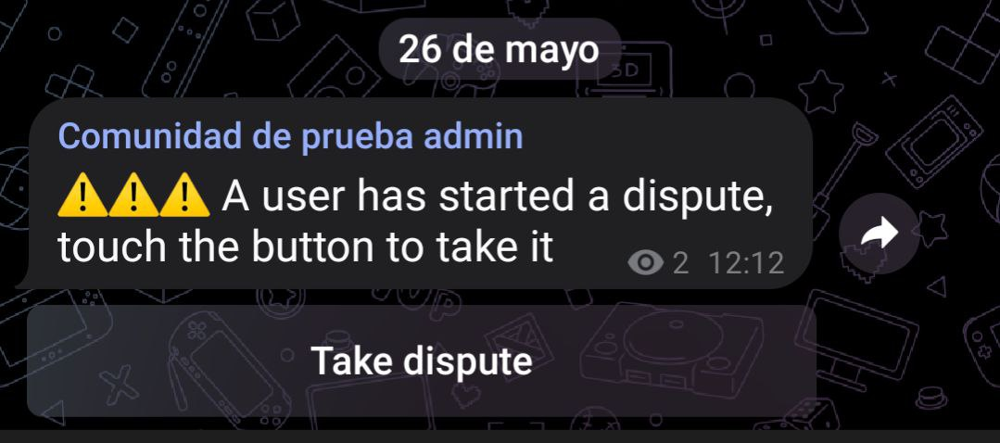
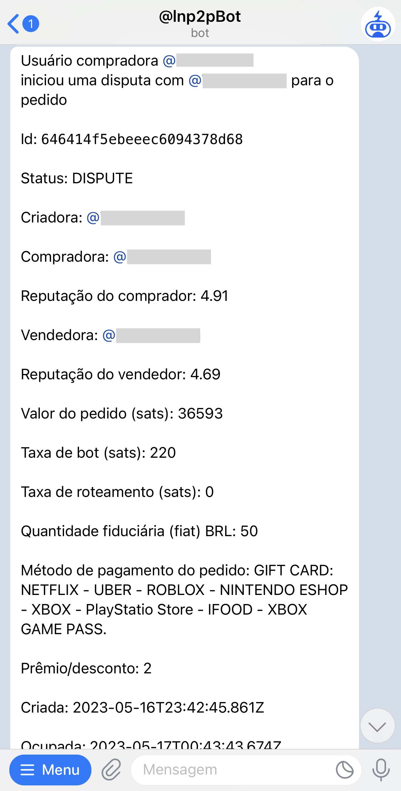

# Resolvendo disputas

Quando um usuário inicia uma disputa, uma mensagem será enviada pelo bot para o canal de disputas. Somente os **solvers** poderão tomá-las, tocando o botão **Take dispute**. Antes de tomar uma disputa, o solver deve ter certeza de que tem a comunidade configurada. Para configurar a comunidade, o solver deve executar o comando `/setcomm @community-group`.

Uma vez que o solver tome a disputa, o bot enviará todas as informações necessárias para resolvê-la, incluindo o número de token do vendedor e do comprador; esse número é diferente para cada um. O solver deve escrever para ambos e dizer-lhes o número de token, para que possam comprovar que ele realmente tomou a disputa. Em seguida, deve pedir as provas necessárias para entender o que aconteceu e **completar** o pedido ou **cancelá-lo**.

