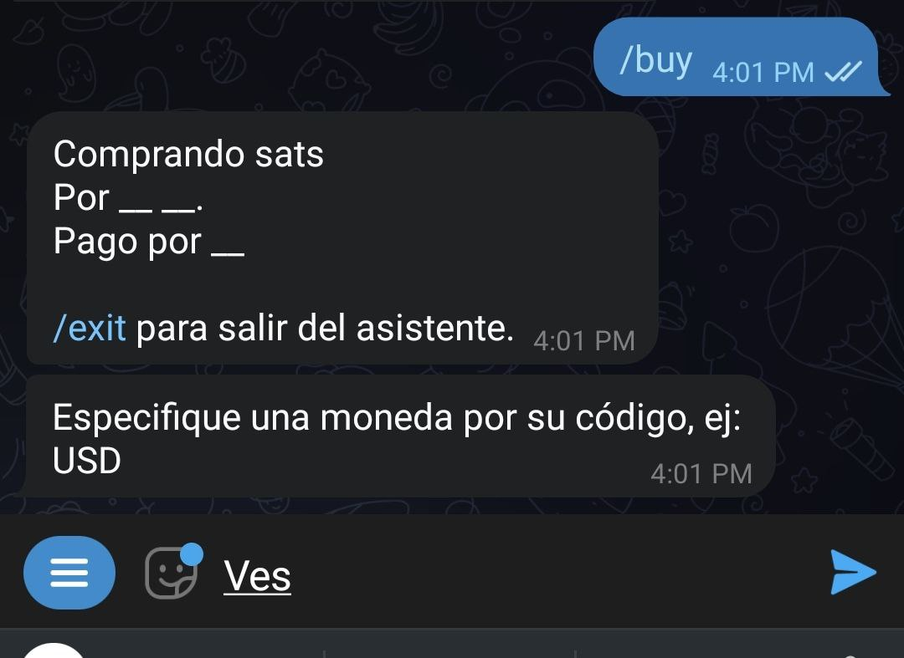
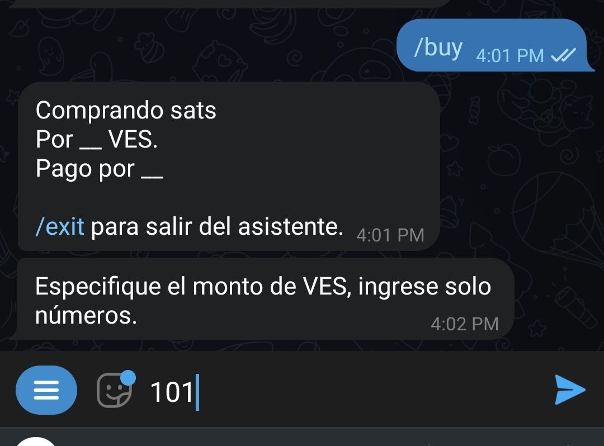
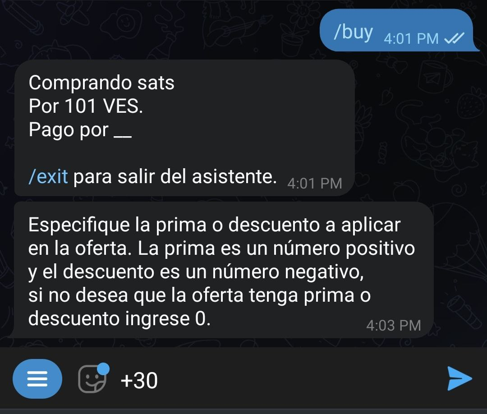
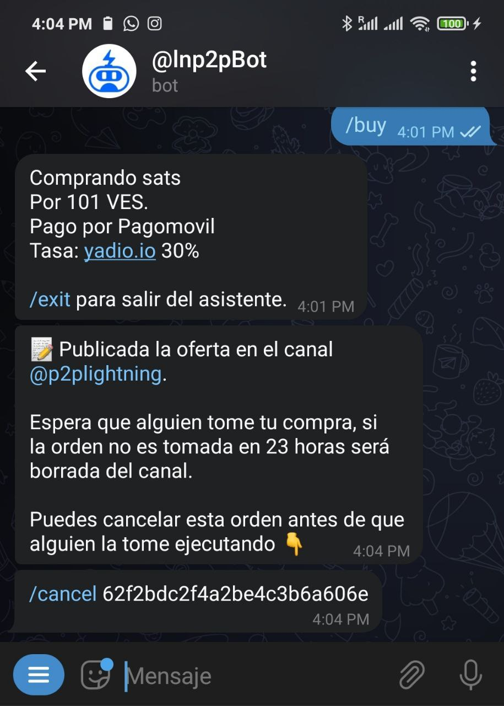

# ¿Cómo creo una orden de compra?

El procedimiento es exactamente el mismo que para la orden de venta. Solo que, que al pulsar el botón "Menú", debes seleccionar el comando `/buy` en lugar de `/sell`. Este activará el asistente (*wizard*) que te guiará por el proceso de comprar.

Una vez activado, el asistente te pedirá que especifiques la moneda fíat con la que quieres transar:

A continuación deberás introducir el monto, en moneda fíat, que quieres comprar. Recuerda ingresar solo números en este paso, para que el asistente te pueda entender.

También puedes introducir un rango de cantidades a comprar, separando los números por un guion (-).

El asistente te preguntará el monto, en satoshis, que quieres recibir. Aquí tienes la posibilidad de usar el botón "Precio del mercado". Si lo haces, se aplicará la tasa de [Yadio.io](https://yadio.io/).

Lo siguiente que te solicita el asistente es el porcentaje de prima o descuento que quieres en tu intercambio. Si quieres aumentar la tasa de mercado (prima), selecciona un número positivo; si quieres disminuirla (descuento), selecciona un número negativo. En caso de no querer ninguna, usa el botón "Sin prima ni descuento".

A continuación, deberás especificar el método de pago. En este campo puedes ponerte creativo y añadir emoticones o lo que consideres para hacer atractiva tu oferta.

El bot procederá a publicar tu oferta en el canal general o el de la comunidad que hayas configurado como predeterminada. Permanecerá visible por 23 horas, si nadie la toma antes de ese tiempo.

En cualquier momento puedes cancelar la oferta, siempre y cuando nadie la haya tomado, usando el comando `/cancel` seguido por el identificador de la orden. También puedes copiar el comando más el identificador en el chat con el bot.

El asistente te devolverá un mensaje confirmando la cancelación y se removerá tu oferta del canal de ofertas.

En caso de que tu oferta sea tomada, el asistente te pedirá que entregues una factura en Lightning Network con el monto en satoshis correspondiente. Al mismo tiempo le pedirá a tu contraparte que pague la factura. 

En este momento el bot pondrá en contacto a ambas partes para que discutan los detalles del intercambio.

Una vez que hayas hecho el pago en fíat, notifica al bot con el comando `/fiatsent`. El bot avisará a tu contraparte para que consulte y verifique la recepción del dinero, y proceda a liberar los satoshis. Recuerda que para recibirlos tu cartera deberá estar en línea.

El intercambio ha terminado. Ahora puedes calificar a tu contraparte.

Puedes salir del asistente en cualquier momento ejecutando el comando `/exit`.

Para ejecutar la misma orden de compra, sin usar el asistente, debes escribir tu orden con los detalles: `/buy`<monto en sats> <monto en fiat> <código fiat> <método de pago> [prima/descuento] (sin los carácteres especiales).

Ejemplo: `/buy 100000 50 usd "xyz bank"`

Compro cien mil sats a cincuenta dólares pago por banco xyz

Algunos ejemplos de órdenes de compra serían los siguientes:

- Ej. `/buy 0 50 ves "banco xyz"`: Compro cincuenta bolívares en sats -en este caso el bot hará el cálculo a la tasa de mercado- pago por banco xyz
- Ej. `/buy 0 10-100 pen "pago móvil"`: Compro de 10 a 100 nuevos soles -en este caso el vendedor elegirá qué monto venderte en ese rango- pago por pago móvil
- Ej. `/buy 0 100 eur "pago móvil" -3`: Compro 100 euros descontando 3% -en este caso el bot hará el cálculo a la tasa de mercado descontando o incrementando el porcentaje que elijas- pago por pago móvil

De haber alguna variable no compatible, el bot te lo indicará durante el proceso de creación de la orden. Al completarla, la misma se publicará automáticamente en el canal de intercambio y será visible por un período de 23 horas.
