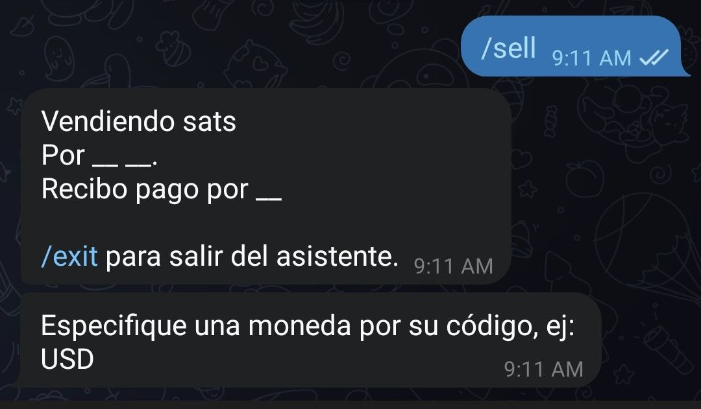
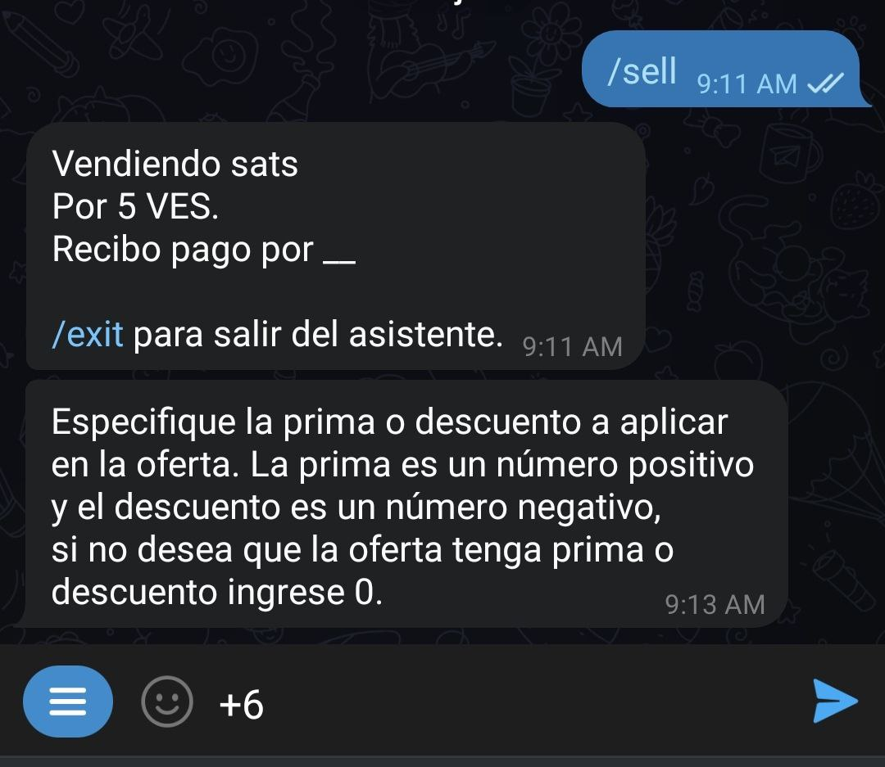

#  ¿Cómo creo una orden de venta?

El procedimiento es exactamente el mismo a la orden de compra, sustituyendo el comando  `/buy` por `/sell`

Una vez activado el asistente que te guiará por el proceso de vender te pedirá que especifiques la moneda fiat en la que quieres transar.

A continuación deberás introducir el monto (en la moneda fiat) que quieres a cambio de tus satoshis. Recuerda ingresar solo números en este paso, para que el wizard te pueda entender.

También puedes introducir un rango de cantidades a comprar, separando los números por un guión (-).

El robot te preguntará el monto, en satoshis, que quieres entregar. Aquí tienes la posibilidad de usar el botón 'Precio del mercado'; si lo haces, se tomará la tasa de [Yadio.io](https://yadio.io/).

Lo siguiente que te solicita el asistente es la prima o descuento que quieres en tu intercambio. Si quierres añadir, usa un número positvo, si quieres disminuir, usa un número negativo. En caso de no querer ninguna, coloca 0.

Deberás especificar el método de pago a continuación, en este campo es donde puedes ponerte creativo y añadir emoticones o lo que consideres para hacer atractiva tu solicitud.

El robot procederá a publicar tu oferta en el canal general o el de la comunidad que hayas configurado como predeterminada, permanecerá visible por 23 horas, sí nadie la toma antes de ese tiempo.

En cualquier momento puedes cancelar la oferta, siempre y cuando nadie la haya tomado, con el comando `Cancel` seguido por el identificador de la orden, o copiando el comando mas el identificador en el chat con el robot

Se te devolverá un mensaje confirmando la cancelación y se removerá tu oferta del canal de ofertas

En caso de que tu venta sea tomada, se te pedirá que pagues una factura en Ligthning Network con el monto en satoshis correspondiente, mas una comisión del 0,6%. Recuerda que la red puede cobrarte un monto adicional por el movimiento, esa cantidad dependerá de los nodos por los que pasará tu transacción y del estado de la red, pero no tiene que ver nada con el robot.

Al mismo tiempo se le pedirá a tu contraparte que entregue una factura. 

Es en este momento en que el robot pondrá en contacto a ambas partes para que discutan los detalles del intercambio. 

Una vez que el robot recibe el aviso de que recibiste el pago en fiat te envía un alerta para que revises tu cuenta, si todo está en orden, puedes liberar los satoshis con el comando `release` seguido del identificador de transaccion (o copia y pega el texto en el robot) y se ejecutará la transacción.

El intercambio ha terminado, puedes ahora calificar a tu contraparte.

Puedes salir del asistente en cualquier momento ejecutando la orden `/exit`

Para ejecutar la misma orden de venta, sin usar el asistente, debes escribir tu orden con los detalles: ` /sell <monto en sats> <monto en fiat> <código fiat> <método de pago> [prima/descuento]`  sin los carácteres especiales.

Ej. /`sell 100000 50 usd "banco xyz"` Vendo cien mil sats a cincuenta dólares cobro por banco xyz
Tal como en las órdenes de venta, en caso de haber alguna variable no compatible el bot te lo indicará durante el proceso de creación de la orden. Al completarla, la misma se publicará en el canal de intercambio y será visible por un período de 23 horas.
