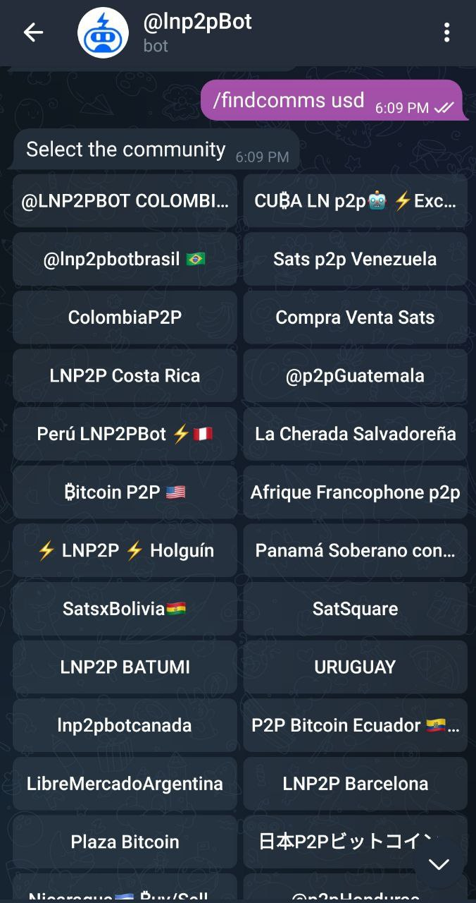
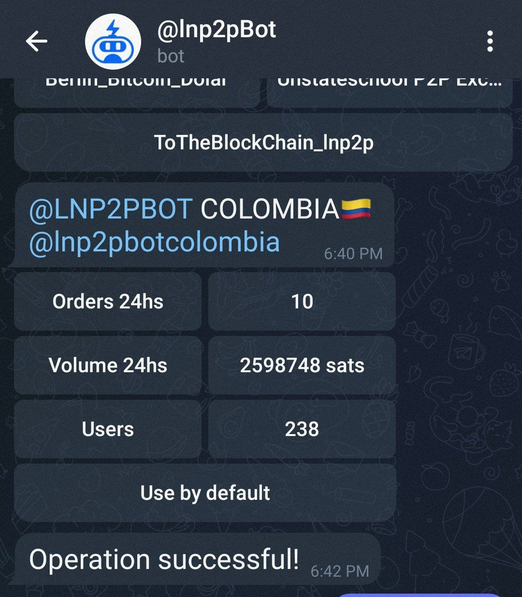
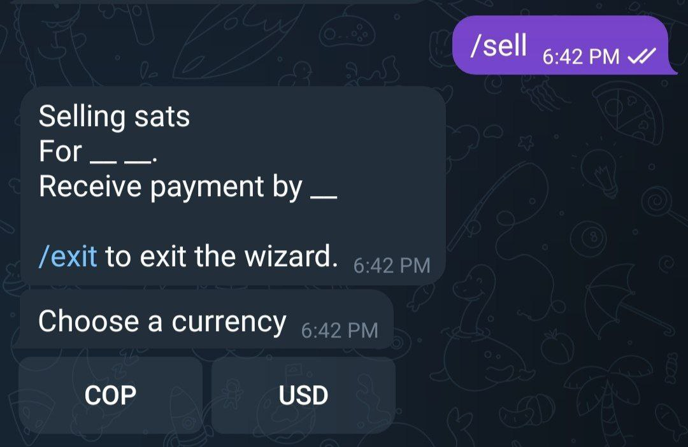

# ¿Cómo publico ofertas en una comunidad?
Cuando comienzas a usar [@lnp2pBot](https://t.me/lnp2pbot) las órdenes que creas son publicadas por defecto en [https://t.me/p2plightning](https://t.me/p2plightning) que es el canal general donde puedes encontrar ofertas en varias monedas fíat.

Si quieres publicar ofertas en un canal que sea específico para tu moneda, debes hacerlo a través de alguna [comunidad](./communities.md) que la tenga incorporada. 

- Puedes buscar cuáles son todas las comunidades que operan con la moneda deseada en [https://market.lnp2pbot.com](https://market.lnp2pbot.com).

- También puedes escribir dentro del bot:

`/findcomms <fiat code>`

Por ejemplo `/findcomms usd` se utiliza para buscar todas las comunidades que comercian con USD. Si no sabes cuál es el código de tu moneda, escribe dentro del bot `/listcurrencies` y encuéntralo.

Al seleccionar alguna comunidad el bot mostrará la cantidad de órdenes exitosas, el volumen de comercio operado en las últimas 24 horas, y la cantidad de usuarios que publican sus ofertas allí. Para configurar en cuál comunidad quieres pubicar tus ofertas, debes seleccionar el botón "Utilizar por defecto".

- Otra forma de hacerlo es escribir: 
`/setcomm <@communityGroupName | telegram-group-id>` (`/setcomm` junto con el nombre del grupo, o su ID de telegram).

Para crear una orden dentro de alguna comunidad se usa el comando `/buy` o `/sell` dependiendo de lo que se quiera. A partir de ahí el bot te dará las intrucciones paso a paso y tu oferta se publicará en la comunidad seleccionada.

## Más información:
- Solo puedes tener configurada por defecto una comunidad a la vez, y por tanto todas tus ofertas se publicarán allí.

- Para salir de una comunidad y volver a publicar ofertas en el [canal general](https://t.me/p2plightning), debes escribir:
`/setcomm off`

- Si quieres publicar una oferta en varias comunidades a la vez, debes crearla en cada una por separado: primero la publicas en una, luego configuras otra para usar por defecto y publicas allí también, y así en todas las que la quieras poner.

Otra manera es escribir tu orden en forma de comando dentro del chat de una comunidad que tenga el bot como administrador, pues este la reconocerá y publicará la oferta en esa comunidad sin que tengas que configurarla por defecto.

- Puedes tomar ofertas de todas las comunidades que quieras sin tener que configurar ninguna por defecto.
